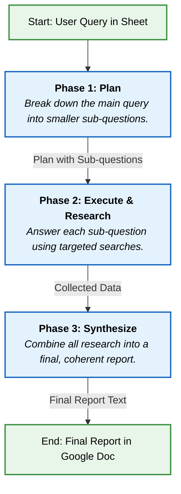

# AI Deep Research Assistant for Google Sheets

Turn a simple Google Sheet into a powerful, automated AI research assistant. This Google Apps Script uses a multi-phase approach with Google's Gemini models to perform in-depth research on any topic you provide, delivering a comprehensive report in a Google Doc.

## The Philosophy: An Automated AI Research Team

Instead of just asking a single AI to answer a complex question, this script acts as a manager for a specialized AI team. It employs a structured **"Divide and Conquer"** strategy to ensure high-quality, in-depth results.

The process is broken down into three distinct phases:

1.  **Phase 1: The Strategist (Plan):** A powerful AI model analyzes your main query and breaks it down into a logical plan of smaller, essential sub-questions.
2.  **Phase 2: The Researcher (Execute):** A fast, efficient AI model takes each sub-question and uses targeted Google searches to find factual, concise answers.
3.  **Phase 3: The Editor (Synthesize):** The strategist AI returns to act as an editor, weaving all the collected research and data into a single, cohesive, and well-written final report.

## How It Works: Visual Workflow

This diagram illustrates the journey of a single query from the Google Sheet to the final Google Doc report.

## Watch a Demo

See how to set up and use the AI Research Assistant in just a few minutes.

*(Click the image to watch the video)*

## Getting Started: 5-Minute Setup

Follow these steps to get your AI Research Assistant running.

### Prerequisites

*   A Google Account (e.g., Gmail).

### Step 1: Get Your Google Gemini API Key

1.  Go to **[Google AI Studio](https://aistudio.google.com/app/apikey)**.
2.  Click **"Create API key"**.
3.  Copy the generated key and save it somewhere safe. You'll need it in the next step.

### Step 2: Create the Google Apps Script

1.  Go to **[script.google.com](https://script.new)** and click **"New project"**.
2.  Delete the placeholder code in the `Code.gs` file.
3.  Copy the entire code from the `Code.gs` file in this repository and paste it into the script editor.
4.  Find the `const apiKey = "YOUR_API_KEY";` line and paste your Gemini API key between the quotes.

### Step 3: Enable the Google Drive Service

For the script to create Google Docs, you must enable the Drive API service.

1.  In the Apps Script editor, look at the left-hand menu.
2.  Next to **Services**, click the `+` icon.
3.  Find **Google Drive API** in the list, select it, and click **Add**.
4.  The `Drive` service will now appear in your services list. **Save the project** (Ctrl + S or Cmd + S).

### Step 4: First Run & Sheet Creation

The first time you run the script, it will create the Google Sheet for you.

1.  Ensure the `const SHEET_ID = "";` line is empty.
2.  Select the `performDeepResearch` function from the dropdown menu at the top.
3.  Click **Run**.
4.  A popup will ask for authorization. Grant the script the necessary permissions.
5.  Another popup will appear with the **ID of your new Google Sheet**. Copy this ID.

### Step 5: Configure and Run Your Research

1.  Go back to your script and paste the new Sheet ID into the `const SHEET_ID = "PASTE_YOUR_ID_HERE";` variable. **Save the project**.
2.  Open the newly created Google Sheet.
3.  Enter your research topics in the first column (`User Search Query`), starting from cell A2.
4.  Go back to the Apps Script editor and click **Run** again.

The script will now process each query, and the links to the final Google Doc reports will appear in the second column.

## In-Depth Article

For a deeper dive into the architecture, philosophy, and advanced usage of this tool, check out our detailed Medium article.

➡️ **[Read the full article on Medium](https://medium.com/@stephane.giron/bulk-deep-research-with-gemini-and-google-apps-script-0ff01f5462d0)**

## License

This project is licensed under the MIT License - see the [LICENSE.md](LICENSE.md) file for details.
